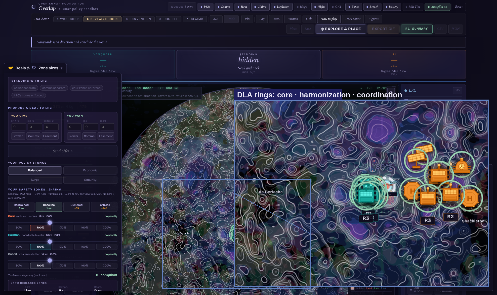
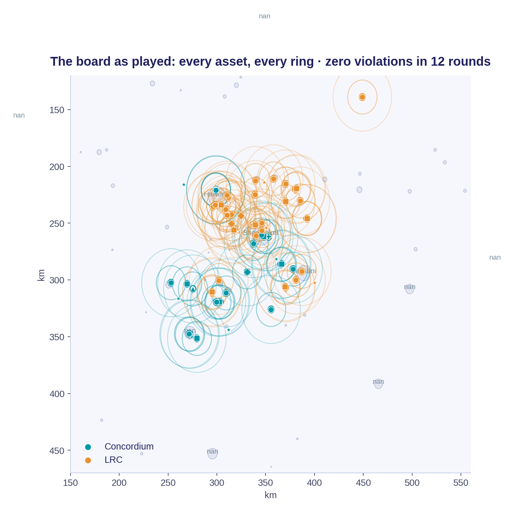

# Overlap

*A lunar policy sandbox.* Safety zones are the mechanic and the metaphor. The game is what happens where they overlap.



Overlap is a browser-based governance simulation of the lunar south pole. Two coalition programs, an Artemis-style bloc and an ILRS-style bloc, compete and cooperate over water ice in permanently shadowed regions. Every asset projects a three-tier keep-out zone. Crowding a neighbor bleeds points every turn. Deconfliction is negotiated at the table, and a debrief decomposes every score into why.

I built it as my Open Lunar Foundation fellowship deliverable, with Tommy Smith, on Christine Tiballi's Designated Lunar Area framework. It sits on three years of PhD research on lunar systems of systems, ISRU architectures, and ISRU governance at Georgia Tech (ASDL and ESPL). The zone geometry comes from Paulson and Roberts, AIAA SciTech 2026. The economy comes from Paulson, Balchanos, and Mavris, AIAA SciTech 2026. The terrain scoring comes from the LFI, SOFI, and IFI favorability indices developed in the same research line.

## Why a game

There is no empirical record of multi-actor lunar surface operations, so this future can only be simulated. The treaty text is indeterminate by design: due regard only means something in a specific place, between specific actors, on a specific day. A game forces the text to commit to outcomes. Policy wargaming has a long lineage, from RAND and Schelling to recent lunar tabletops, and it produces behavior rather than opinions. In our playtests, a sunlight-denial strategy and a zones-as-territory claim both emerged from players, unprompted.

## Quick start

Requires [Node.js](https://nodejs.org/) 18 or newer.

```bash
npm install
npm run dev
```

Open the URL it prints. Solo and facilitator modes run fully in the browser with no server. If you just want to try it without installing anything, grab the standalone build from the releases page, unzip it, and run the included start script.

### Production build

```bash
npm run build      # outputs to dist/
npm run preview
```

### LAN multiplayer (optional)

```bash
npm start          # Vite client plus the socket.io relay on :8787
npm run test:mp    # end-to-end relay test: host, join, sync, act, leave
```

## The map is real

Terrain, illumination, slope, and hydrogen signatures are derived from Lunar Reconnaissance Orbiter data products (LOLA, LEND, Diviner). On top of the raw layers the sim computes three favorability indices:

- LFI, landing: can a lander touch down here intact?
- SOFI, surface operations: can a system stay alive and productive here?
- IFI, ice: is the water here in usable form?

No location maximizes all three. That is the central lesson. Site selection is a set of trade-offs, adjacency is the resource, and the handful of sites where the indices stack is where actors collide.

## Running it in a workshop

1. `npm run dev`, choose Solo or set up a lobby.
2. Pick a scenario preset, deploy, and place each actor's base. The rest of the round runs on autopilot so players spend their attention on decisions.
3. As facilitator, push injects (solar flares, ITAR reviews, national-security designations), watch the live violations HUD, and convene a Conference of Parties when the table needs to talk. Convene freezes the clock.
4. End the exercise and walk the room through the debrief. The scoreboard explains itself.

Press `?` in the app for shortcuts: `H` tour, `Z` hazard framework, `L` mission log, `A` analytics, `P` physics parameters.

## Research mode

The same simulation runs headless as a Monte Carlo instrument. Seeds are deterministic (base `0x5EED2026`, stride 9973), so equal-seed trials across configurations are matched pairs and every cross-config comparison is a paired test.

```bash
npm install -D puppeteer
npm run build
npm run mc:full      # 13-config battery + per-round timeseries + report
npm run mc:verify    # 10 fixed seeds, canonical SHA-256, see VERIFY.md
```

`mc:full` writes a trials CSV (52 columns: scores, ice, violations, failure telemetry with cause attribution, reserve ledgers), a per-round long-format CSV, and a markdown report with paired deltas and 95 percent CIs. `MC_RUN_PLAN.md` documents what each configuration answers and how to read the columns. `mc:verify` prints a hash you can compare across machines; the reference values are in `VERIFY.md`.

Headline results from the 2,550-trial battery, all paired against the standard board:

- A permanent shared power grid cuts violations by 2.31 per round and adds 321 points, at about 12 percent less ice. Removing the sharing option costs 2.55 violations per round and 535 points. Commitment beats optionality.
- ITU-style registration priority doubles the violation rate exactly (the x2 weight lands at +8.45 on an 8.1 baseline) while ice is statistically unchanged. Regimes reprice friction; they do not restrict extraction.
- Arriving two days late already costs about 1,785 points and an 87 percent first-mover win rate. The penalty is being second at all.
- Per-round violations rise as ice near established bases taps out. Local scarcity breeds friction.

## Exports and evidence

Every session can export a full reconstruction CSV: per-round metrics, every asset with declared versus baseline ring radii, rover traces, zone interactions, crater state, and the complete event log. The tabletop is a data-collection instrument, not just an exercise. `docs/session-board.png` is a July 2026 session rendered entirely from its own export.



## Data

The `data/` folder ships the published datasets: the 2,550-trial Monte
Carlo battery with per-round telemetry and its analyzer report, and a
complete July 2026 human session export down to the event log. See
`data/README.md`. Everything regenerates from a fixed seed; verify your
build against the reference hash first (`npm run mc:verify`).

## DLA hazard framework

Keep-out radii can be driven by the Open Lunar Lunar Radius Framework. Import a `buffers.json` in the hazard panel (`Z`) or drop one into `public/` before launch; the sim reprojects `zones_km` into its own pixel scale and falls back to defaults if the file is absent or malformed. `public/buffers.json` is gitignored because it is a generated per-scenario file.

## Project layout

```
src/
  App.jsx              main application and render loop
  Lobby.jsx            multiplayer lobby and solo entry
  FacilitatorPanel.jsx inject deck UI
  sim/                 pure, unit-tested simulation core (no React)
  ui/                  panels, overlays, sidebars
public/maps/           LRO-derived basemaps and data layers
server/                optional socket.io multiplayer relay
tests/                 node --test suites (511 tests)
tools/                 mc-sweep, mc-analyze, lint, asset generators
```

The simulation core has no React dependencies and is tested directly in Node. Development history and architecture notes are in `DEV_NOTES.md`; the full version history is in `CHANGELOG.md`.

## Tests

```bash
npm test       # 511 tests, each pinning a historical bug class
npm run lint   # dependency-free unused-import check
```

CI runs tests, lint, and a production build on every push.

## Design constraint

Artemis and ILRS must both be present in every two-actor configuration. The bloc-versus-bloc tension between the two leading coalition programs is the exercise. Commercial and emerging-state archetypes are a third actor or facilitator pressure, never a replacement for either core actor.

## Roadmap

Actor disaggregation (the internal-negotiation foundation is built and surfaced in setup), a national-security inject, an orbital disposal layer (crash debris already charges surface violations), and more human sessions. Details in `ROADMAP.md`.

## Citing

See `CITATION.cff`. The zone-interaction model and the ISRU economics are published in two AIAA SciTech 2026 papers listed there.

## Acknowledgments

Tommy Smith, co-developer. Christine Tiballi, whose DLA framework the zone tiers implement. Aaron Mackey, whose if/then hazard toolkit the buffers import supports. The June 13 and July 1 playtest crews, who argued with the tool until it improved. Open Lunar Foundation, 2026 fellowship.

## License

MIT. See `LICENSE`. The underlying lunar data products are from NASA LRO instruments and are in the public domain. The map renderings, simulation, and design are part of this project.
