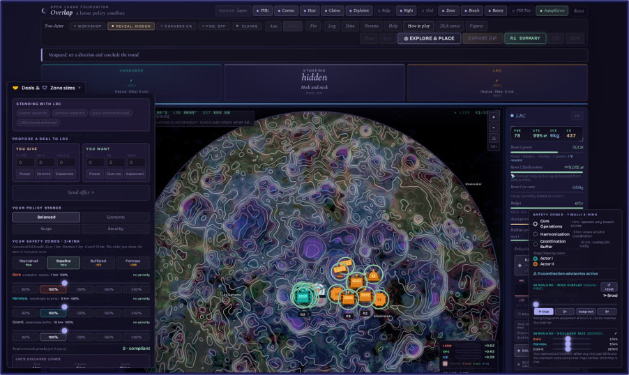
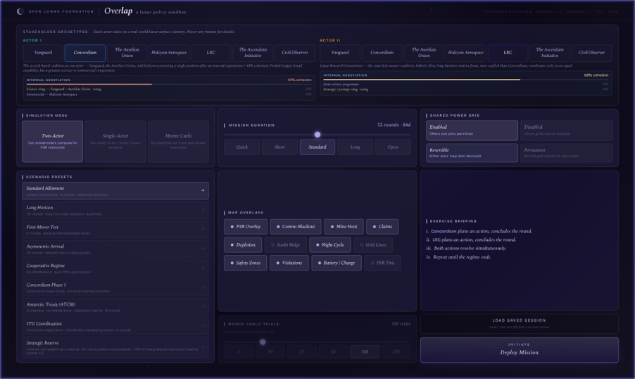
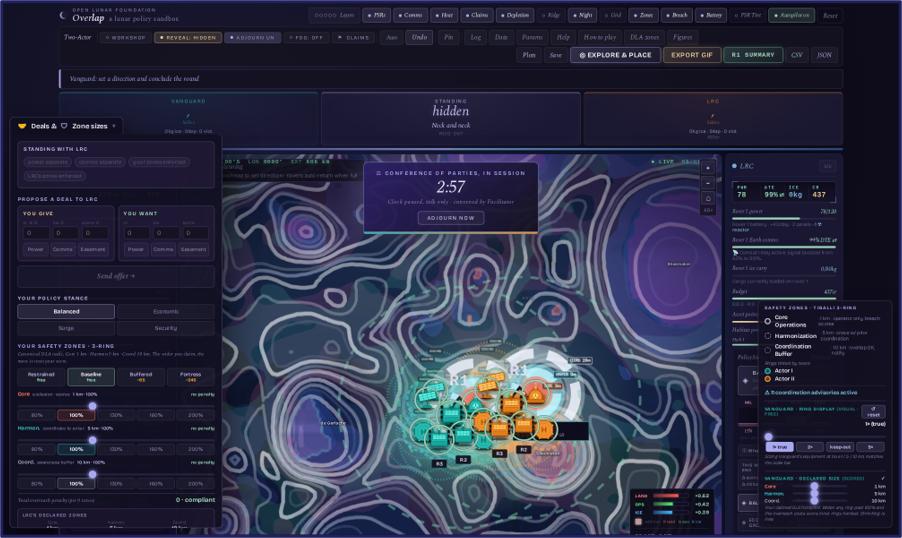
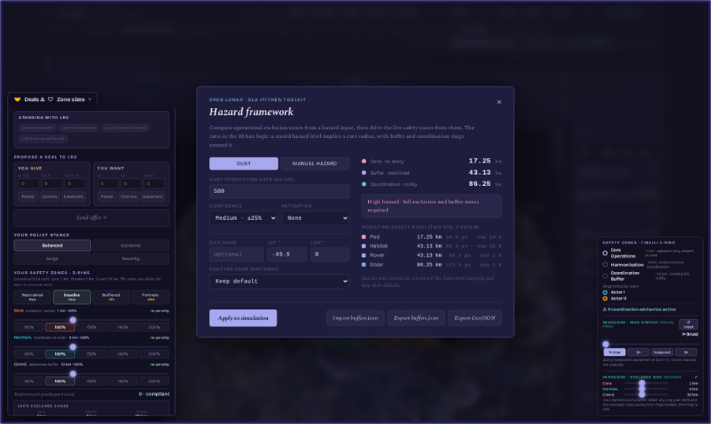

# Overlap

*A lunar policy sandbox, amid a global rush to the Moon's south pole for its water ice and other resources.* Safety zones are the mechanic and the metaphor. The game is what happens where they overlap. Surface conflicts early enough, virtually, to resolve them at the Moon in time.



Overlap is a browser-based governance simulation of the lunar south pole. Two rival coalition programs compete and cooperate over water ice on terrain derived from NASA Lunar Reconnaissance Orbiter data (the LOLA, LEND, and Diviner instruments). Every asset projects a three-tier keep-out zone from Christine Tiballi's Designated Lunar Area framework. Crowding a neighbor bleeds points every turn. Deconfliction is negotiated at the table, and every session exports its complete history.

Built by Vic Paulson for the 2026 Open Lunar Foundation fellowship, with Tommy Smith, and coded with the help of Claude (Anthropic). The zone geometry and the ISRU economics come from two AIAA SciTech 2026 papers; the terrain scoring comes from the LFI, SOFI, and IFI favorability indices from the same research line.

## Quick start

Requires [Node.js](https://nodejs.org/) 18+.

```bash
npm install
npm run dev
```

No install: grab the standalone build from Releases, unzip, run the start script.



## Play it in a room

Pick a scenario, place bases, and let the round autopilot carry the logistics while players spend their attention on decisions. The facilitator pushes injects, watches the live violations HUD, and can convene a Conference of Parties that freezes the clock while the table talks. In our July session, the convene produced a negotiated 50-50 crater split, an Outer Space Treaty standoff, and zero safety violations in twelve rounds.



Zone radii can be driven by the Open Lunar Lunar Radius Framework: import a `buffers.json` in the hazard panel and the sim adopts those rings.



## Research mode

The same simulation runs headless as a Monte Carlo instrument on deterministic seeds, so every cross-configuration comparison is a matched pair.

```bash
npm install -D puppeteer && npm run build
npm run mc:full      # 13-config battery + per-round telemetry + report
npm run mc:verify    # canonical hash for cross-machine reproducibility
```

Headline results from the 2,550-trial battery: governance regimes reprice friction without restricting extraction (ITU-style registration lands at exactly twice the baseline violation rate with ice unchanged), a permanent shared grid beats a reversible one, and arriving two days late already decides most sessions. Full findings in `data/mc_report.md`; methods in `MC_RUN_PLAN.md`.

## Data

`data/` ships the 2,550-trial battery with per-round telemetry, the analyzer report, and a complete human session export. `figures/` holds every chart from the showcase and the blog series in `docs/blog/`.

## The close-out white paper

The fellowship's written deliverable, seven pages with figures: the problem, the method, both evidence streams, the zone ruler, and five recommendations for DLA framework development. [docs/Overlap-Whitepaper.pdf](docs/Overlap-Whitepaper.pdf).

## Tests

```bash
npm test       # 511 tests
npm run lint
```

## Citing

GitHub's "Cite this repository" button uses `CITATION.cff`. Plain form:

> Paulson, L.V. and Smith, T. (2026). *Overlap: a lunar policy sandbox* (v2.7.215) [software]. Open Lunar Foundation fellowship. https://github.com/openlunar/overlap

```bibtex
@software{paulson2026overlap,
  author  = {Paulson, Lauren Victoria and Smith, Tommy},
  title   = {Overlap: a lunar policy sandbox},
  year    = {2026},
  version = {2.7.215},
  url     = {https://github.com/openlunar/overlap},
  note    = {Open Lunar Foundation fellowship deliverable}
}
```

The models the simulation implements are published separately; cite them for the science:

- Paulson, L.V. and Roberts, T.G. (2026). Modeling Safety-Zone Interactions and Resource Access in Lunar South-Pole PSRs. *AIAA SciTech Forum.* The zone geometry.
- Paulson, L.V., Balchanos, M., and Mavris, D. (2026). Simulating Economic and Environmental Trade-offs in Lunar Water Supply: ISRU vs. Earth Resupply. *AIAA SciTech Forum.* The economy.

## Acknowledgments

Tommy Smith, co-developer. Christine Tiballi, whose DLA framework the zones implement. Aaron Mackey, whose if/then hazard toolkit the buffers import supports. Claude (Anthropic), development assistant throughout. The June and July playtest crews, who argued with the tool until it improved. Open Lunar Foundation, 2026 fellowship.

## License

- **Code**: free to use. Take as much of it as you want: fork it, modify it, run workshops with it. Full terms in `LICENSE`.
- **One ask, not a condition**: if you run a workshop or session with Overlap, please send me the reconstruction CSV export. Session data is how this tool got good, every playtest export became fixes and findings, and yours would feed the research. Open an issue or reach out.
- **Datasets and figures** (`data/`, `figures/`, `docs/`): CC BY 4.0. Reuse freely with attribution; the citation above satisfies it.
- **Source lunar data**: derived from NASA LRO instruments (LOLA, LEND, Diviner, LROC), public domain per NASA data policy. Credit the instrument teams when you reuse the raw layers in `public/maps/`.

If you build something on this, I would genuinely like to hear about it.
